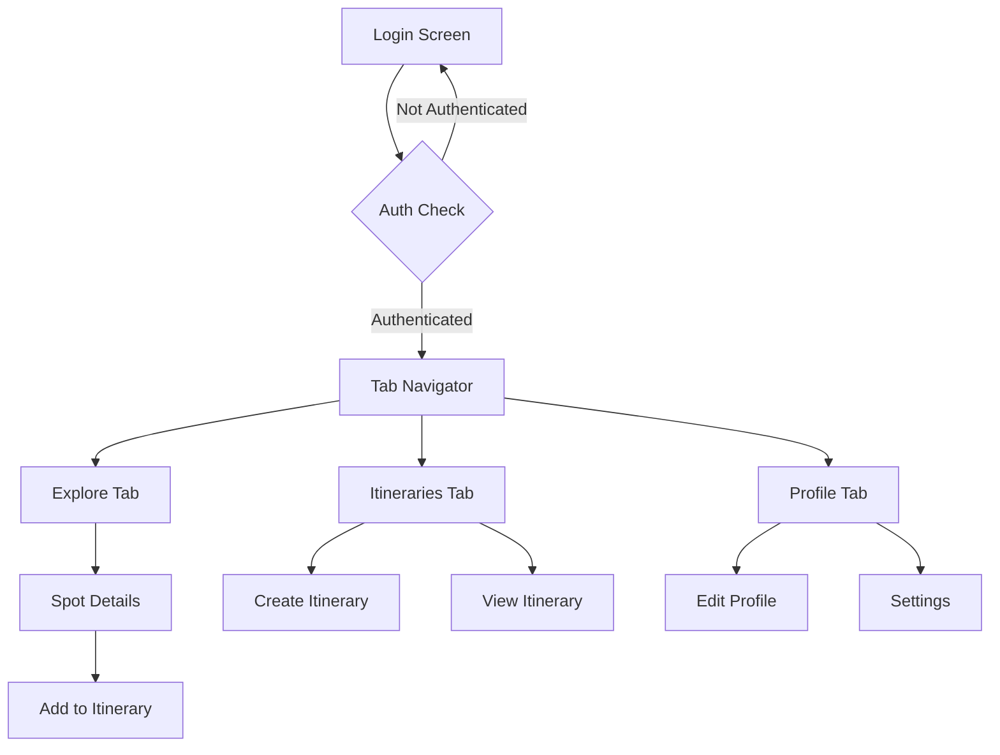
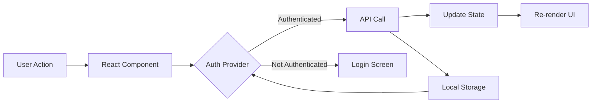
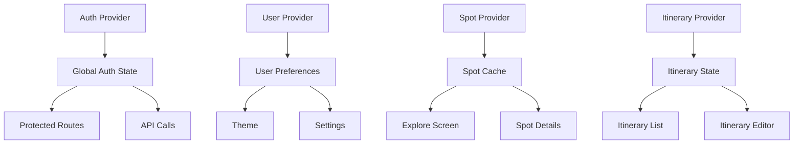
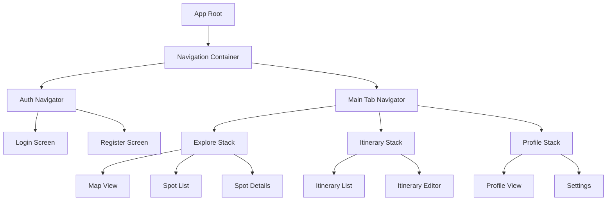
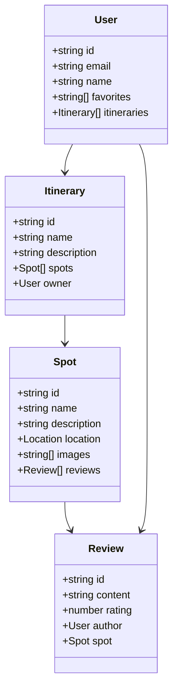

# Architecture Diagrams 📊

## Navigation Flow

```mermaid
graph TD
    A[Login Screen] --> B{Auth Check}
    B -->|Authenticated| C[Tab Navigator]
    B -->|Not Authenticated| A
    
    C --> D[Explore Tab]
    C --> E[Itineraries Tab]
    C --> F[Profile Tab]
    
    D --> G[Spot Details]
    G --> H[Add to Itinerary]
    
    E --> I[Create Itinerary]
    E --> J[View Itinerary]
    
    F --> K[Edit Profile]
    F --> L[Settings]
```

## Data Flow

```mermaid
graph LR
    A[User Action] --> B[React Component]
    B --> C{Auth Provider}
    C -->|Authenticated| D[API Call]
    C -->|Not Authenticated| E[Login Screen]
    D --> F[Update State]
    F --> G[Re-render UI]
    
    H[Local Storage] --> C
    D --> H
```

## State Management Architecture

```mermaid
graph TD
    A[Auth Provider] --> B[Global Auth State]
    B --> C[Protected Routes]
    B --> D[API Calls]
    
    E[User Provider] --> F[User Preferences]
    F --> G[Theme]
    F --> H[Settings]
    
    I[Spot Provider] --> J[Spot Cache]
    J --> K[Explore Screen]
    J --> L[Spot Details]
    
    M[Itinerary Provider] --> N[Itinerary State]
    N --> O[Itinerary List]
    N --> P[Itinerary Editor]
```

## Component Hierarchy

```mermaid
graph TD
    A[App Root] --> B[Navigation Container]
    B --> C[Auth Navigator]
    B --> D[Main Tab Navigator]
    
    C --> E[Login Screen]
    C --> F[Register Screen]
    
    D --> G[Explore Stack]
    D --> H[Itinerary Stack]
    D --> I[Profile Stack]
    
    G --> J[Map View]
    G --> K[Spot List]
    G --> L[Spot Details]
    
    H --> M[Itinerary List]
    H --> N[Itinerary Editor]
    
    I --> O[Profile View]
    I --> P[Settings]
```

## Data Models

```mermaid
classDiagram
    class User {
        +string id
        +string email
        +string name
        +string[] favorites
        +Itinerary[] itineraries
    }
    
    class Spot {
        +string id
        +string name
        +string description
        +Location location
        +string[] images
        +Review[] reviews
    }
    
    class Itinerary {
        +string id
        +string name
        +string description
        +Spot[] spots
        +User owner
    }
    
    class Review {
        +string id
        +string content
        +number rating
        +User author
        +Spot spot
    }
    
    User --> Itinerary
    Spot --> Review
    User --> Review
    Itinerary --> Spot
``` 